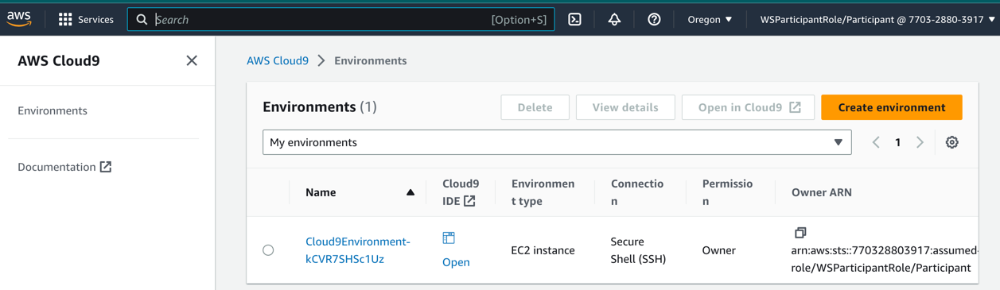

{}
The Cloud 9 Environment is already built for you. Just open the existing IDE in the Cloud9 console as per below.
{}

{}
A list of supported browsers for AWS Cloud9 is found [here]( https://docs.aws.amazon.com/cloud9/latest/user-guide/browsers.html).
{}

{}
Ad blockers, javascript disablers, and tracking blockers should be disabled for
the cloud9 domain, or connecting to the workspace might be impacted.
Cloud9 requires third-party-cookies. You can whitelist the [specific domains]( https://docs.aws.amazon.com/cloud9/latest/user-guide/troubleshooting.html#troubleshooting-env-loading).
{}

### Disable temporary Credentials

Select the gear icon in the upper right (or else select the "9" icon>Preferences in the upper left)

- Scroll down to "AWS Settings" in the "Preferences" tab
- Under "Credentials", disable "AWS managed temporary credentials"
- Close the "Preferences" tab

{}
You **may** need to downgrade kubectl to v 1.21.1. Please follow these steps from the terminal:  
* curl -LO https://dl.k8s.io/release/v1.21.1/bin/linux/amd64/kubectl 
* sudo install -o root -g root -m 0755 kubectl /usr/local/bin/kubectl 
* verify it has worked - kubectl version --client 
{}