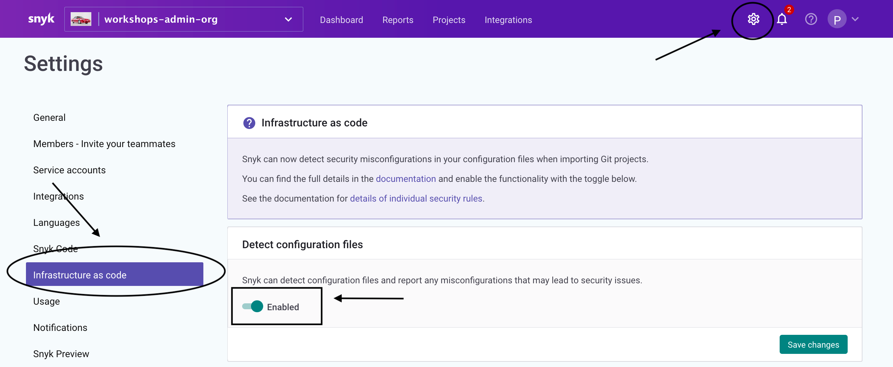
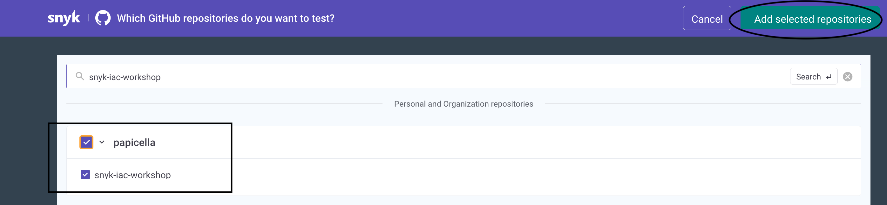
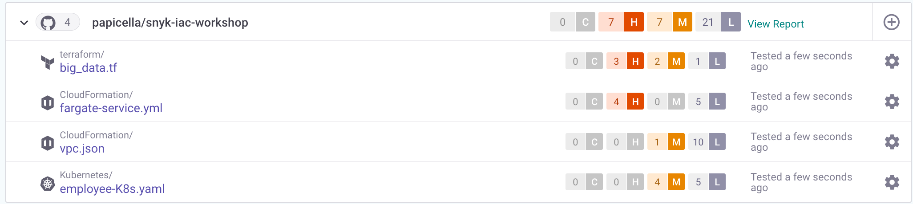
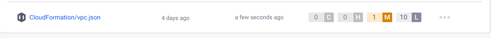
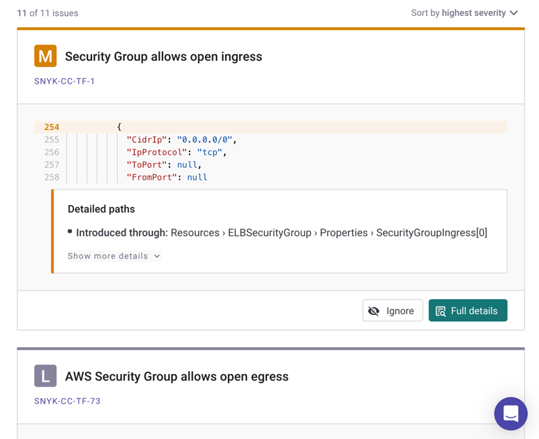

## Step 3 Add project to find vulnerabilities

* Before we get started we need to make sure IaC is enabled navigate to "**Settings -> Infrastructure as code**" and ensure it is enabled as shown below.

Now that Snyk is connected to your GitHub Account, import the Repo into Snyk as a Project.

* Navigate to Projects
* Click "**Add Project**" then select "**GitHub**"
* Click on the Repo you forked "**snyk-iac-workshop**"

__Note: Once complete you should see various IaC scans as shown below_

* Go ahead and click on "**vpc.json**" CloudFormation file as shown below

For each Vulnerability, Snyk displays the following ordered by Line no:

1. Each Vulnerability grouped by line no and severity
2. Each Vulnerability links to the Snyk policy it was defined against including the path to the issue, what the issue is, the impact and how to resolve it
3. The ability to ignore issues you wish to remove from the list

Note: We will resolve some of these issues shortly for now just browse through some of them to get familiar with what was raised and why including clicking on the Snyk Policy links
