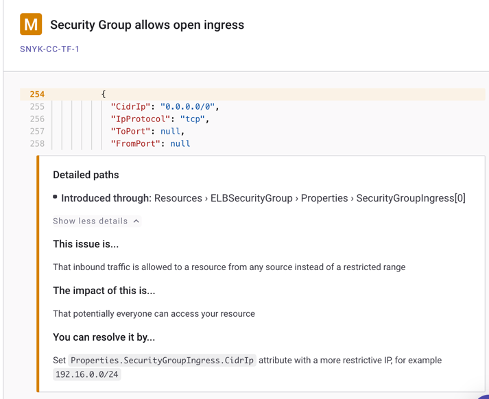
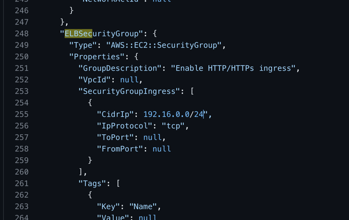
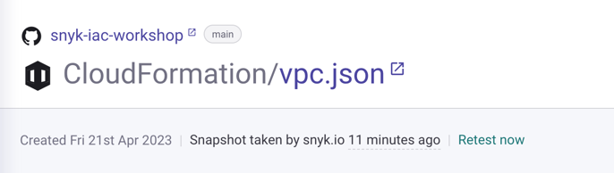

## Step 5 Use the Snyk UI to get remediation advice

* Navigate to Projects
* Click the **vpc.json** CloudFormation file
* Review the first issue "**Security Group allows open ingress**" and click "Show more details"

A Security Group controls the traffic that is allowed to reach and leave the resources that it is associated with. This security group is configured insecurely because inbound traffic is allowed to a resource from any source, instead of a restricted range

We will resolve this by entering an IP range from which traffic is allowed.

* Copy the CidrIp Range **192.16.0.0/24**

* Open the **vpc.json** file directly in GitHub
* Change the CidrIp range from 0.0.0.0/0 to 192.16.0.0/24
* Commit changes.

* In the Snyk UI review the **vpc.json** project again. "**Security Group allows open ingress**" has been remediated and is no longer an issue.

{}
You may need to click the 'Retest now' button as per below to force rescan
{}

